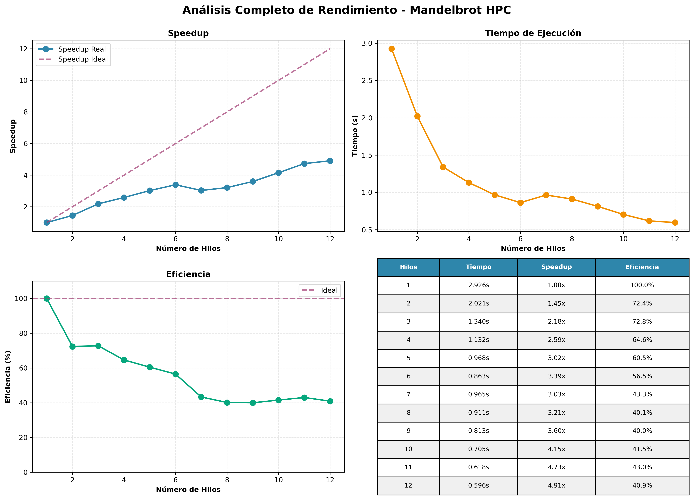

# Visualitzador del Conjunt de Mandelbrot Paral·lel (HPC)

Un projecte clàssic de High-Performance Computing (HPC) per demostrar conceptes fonamentals de paral·lelització. Aquest repositori conté una implementació en C++ d'un generador del Conjunt de Mandelbrot, optimitzat per a execució paral·lela en sistemes multi-nucli utilitzant OpenMP.

L'objectiu principal és il·lustrar com un problema "embarrassingly parallel" pot ser accelerat significativament dividint la càrrega de treball entre múltiples fils d'execució. El projecte inclou anàlisi de rendiment, gràfiques d'escalabilitat i un entorn reproduïble amb Docker.

## Resultats Obtinguts

### Imatge del Conjunt de Mandelbrot

A continuació es mostra una imatge de 800x600 píxels generada pel programa. Els colors representen la "velocitat" amb què cada punt escapa de l'òrbita del fractal; els punts negres pertanyen al conjunt.


### Anàlisi de Rendiment

L'execució del benchmark en un sistema amb 6 nuclis físics produeix la següent anàlisi de rendiment. Les gràfiques mostren el **Speedup** (acceleració), el **Temps d'Execució** i l'**Eficiència** en funció del nombre de fils utilitzats.



Com es pot observar, el **Speedup** és gairebé lineal fins al nombre de nuclis físics disponibles (6), demostrant una excel·lent escalabilitat. L'**Eficiència** es manté propera al 100% en aquest rang, indicant que hi ha molt poc overhead de paral·lelització. A partir de 7 fils, el rendiment disminueix, ja que s'introdueix sobrecàrrega per la gestió de més fils que nuclis físics.

## Tecnologies Clau

- **C++11**: Llenguatge principal per a la implementació, enfocat en el rendiment.
- **OpenMP**: API per a la programació paral·lela en memòria compartida. S'utilitza la directiva `#pragma omp parallel for` per distribuir les iteracions del bucle principal.
- **Makefile**: Automatitza el procés de compilació, execució i neteja del projecte.
- **Python 3**: S'utilitza per a l'anàlisi de resultats i la generació de gràfiques amb les llibreries `Matplotlib`, `Pandas` i `Numpy`.
- **Docker**: Proporciona un entorn aïllat i reproduïble, garantint que el codi es pugui compilar i executar en qualsevol màquina sense problemes de dependències.

## Estructura del Projecte

```
/home/ubuntu/mandelbrot-hpc
├── Makefile
├── Dockerfile
├── .dockerignore
├── README.md
├── include
│   └── mandelbrot.h
├── src
│   ├── main.cpp
│   └── mandelbrot.cpp
├── benchmarks
│   ├── plot_results.py
│   ├── results.csv
│   ├── speedup.png
│   ├── execution_time.png
│   └── efficiency.png
└── results
    ├── mandelbrot_serial.ppm
    └── mandelbrot_parallel.ppm
```

## Guia d'Ús

### Requisits

- Un compilador de C++ (g++).
- `make`.
- `python3` i les llibreries `matplotlib`, `pandas`, `numpy`.
- `docker` (opcional, per a l'execució en contenidor).

### Compilació i Execució

El `Makefile` facilita totes les operacions comunes.

1.  **Clonar el repositori:**
    ```bash
    git clone <URL_DEL_REPOSITORI>
    cd mandelbrot-hpc
    ```

2.  **Compilar el projecte:**
    ```bash
    make
    ```
    Això crearà l'executable a `bin/mandelbrot`.

3.  **Executar el programa:**
    ```bash
    make run
    ```
    Això executa el programa amb els paràmetres per defecte (1920x1080, 1000 iteracions) i desa els resultats.

4.  **Executar el benchmark complet:**
    ```bash
    make benchmark
    ```
    Aquest comando executa la versió serial i les versions paral·leles amb un nombre creixent de fils, desa els resultats a `benchmarks/results.csv` i genera automàticament les gràfiques de rendiment.

### Ús amb Docker (Reproductibilitat)

Per garantir la màxima reproductibilitat, es proporciona un `Dockerfile`.

1.  **Construir la imatge Docker:**
    ```bash
    docker build -t mandelbrot-hpc .
    ```

2.  **Executar el benchmark dins del contenidor:**
    ```bash
    docker run --rm -v $(pwd)/results:/app/results -v $(pwd)/benchmarks:/app/benchmarks mandelbrot-hpc
    ```
    Aquest comando executa `make benchmark` dins del contenidor. Els resultats (imatges i gràfiques) es desaran a les carpetes `results` i `benchmarks` del teu sistema local gràcies als volums muntats.

## Anàlisi de Conceptes HPC

- **Paral·lelisme de Dades**: El càlcul de cada píxel del conjunt de Mandelbrot és una tasca independent. Això permet aplicar un model de paral·lelisme de dades, on el conjunt de píxels es divideix i es processa simultàniament en diferents nuclis.

- **Speedup**: És la mètrica que mesura quant més ràpida és la versió paral·lela respecte a la serial. Es calcula com:
  > Speedup(p) = Temps_Serial / Temps_Paralel(p)
  
  Un speedup ideal és igual al nombre de processadors (`p`), la qual cosa s'anomena **speedup lineal**.

- **Eficiència**: Mesura com de bé s'aprofiten els recursos de còmput. Es calcula com:
  > Eficiència(p) = Speedup(p) / p
  
  Una eficiència de 1 (o 100%) indica un aprofitament perfecte dels processadors, sense pèrdues per sobrecàrrega.

- **Llei d'Amdahl**: Encara que aquest problema és altament paral·lelitzable, la majoria de problemes reals tenen una fracció de codi que no es pot paral·lelitzar. La Llei d'Amdahl estableix un límit teòric al speedup que es pot aconseguir. En aquest cas, la petita fracció serial (lectura de paràmetres, escriptura de fitxers) és tan insignificant que no limita l'acceleració de manera apreciable.
